# maxxy-me User Flow

> **Design history:** This flow includes planned product scope. Use the current
> [root user flow](../../user-flow.md) for daily operation and
> [launch readiness](../launch-readiness.md) for beta status.

## 1. Purpose

This document defines how a user interacts with **maxxy-me**, from authentication through Codex execution and GitHub pull-request review.

Version one supports Codex only, with one or more owner-authorized Codex connections contributing to a logical capacity pool. The owner can create reusable versioned skills, configure a different model and reasoning effort for every agent profile, and use a root agent to plan, delegate, collect, validate, and summarize parallel expert work.

The user may operate maxxy-me in two ways:

1. **Local development mode**
   - the dashboard, worker, PostgreSQL database, host agent, Codex, and repository all run locally;

2. **Production VPS deployment**
   - Cloudflare manages the domain, proxied public edge, and visitor TLS;
   - Caddy, the dashboard, API, worker, WebSocket gateway, PostgreSQL, host agent, Codex, and repositories run on one VPS;
   - optional additional execution hosts connect later through the same outbound WSS protocol.

The browser experience is nearly the same in both modes. The main difference is where the control plane and execution host are running.

---

## 2. Main Components the User Interacts With

```text
maxxy-me dashboard
├── authentication
├── workspaces
├── hosts
├── Codex connections and capacity pools
├── reusable skills and versions
├── root and expert agent profiles
├── model and reasoning settings
├── orchestration plans and child runs
├── tasks
├── agents
├── approvals
├── pull requests
└── activity history

Persistent execution host
├── maxxy host agent
├── isolated Codex credential lanes
├── discovered model and reasoning catalogs
├── verified read-only skill materializations
├── Codex
├── Git
├── GitHub credentials
├── repositories
└── worktrees
```

---

## 3. Authentication Layers

The user may encounter four independent authentication layers:

```text
1. maxxy-me owner authentication
2. execution-host enrollment
3. one or more isolated Codex authentications on the host
4. GitHub authentication and repository authorization
```

These layers must remain separate.

---

## 4. Local Development Flow

### 4.1 Start local services

```bash
bun run dev
```

The development command starts:

- Next.js;
- orchestration worker;
- local PostgreSQL connection;
- local host agent.

The user opens:

```text
http://127.0.0.1:3000
```

### 4.2 First owner setup

```text
Welcome to maxxy-me

Create owner account

Name
[                                   ]

Email
[                                   ]

Password
[                                   ]

[Create owner account]
```

After the owner is created, public signup is disabled.

### 4.3 Local host registration

The local development host may be registered automatically.

The dashboard checks:

```text
✓ Host agent connected
✓ Git available
✓ Codex available
✓ GitHub CLI available
✓ Project root writable
✓ Worktree root writable
```

---

## 5. Cloudflare and VPS Deployment Authentication Flow

The user opens a custom domain:

```text
https://workspace.example.com
```

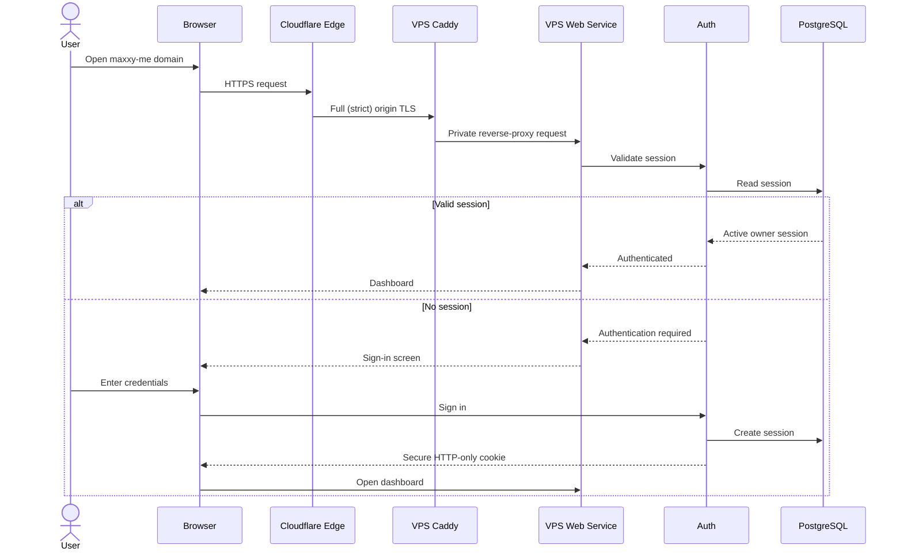

### First deployment

Only the configured bootstrap owner may create the first account.

Before owner setup, the administrator must:

1. activate the domain zone in Cloudflare and enable DNSSEC;
2. create proxied `A` and optional `AAAA` records for the maxxy-me hostname;
3. set Cloudflare SSL/TLS mode to **Full (strict)**;
4. install a matching Cloudflare Origin CA certificate and private key for Caddy;
5. confirm proxied WebSockets reach the web service;
6. restrict origin HTTPS to current Cloudflare IP ranges and SSH to administrator sources.

Afterward:

- public signup is disabled;
- all workspace routes require authentication;
- browser WebSockets require short-lived tickets;
- host WebSockets use separate host credentials.

---

## 6. Enrolling an Execution Host

The user opens:

```text
Settings → Hosts → Add host
```

### 6.1 Create enrollment token

```text
Add execution host

Host name
[ Personal Development Computer         ]

Maximum concurrent agents
[ 4                                     ]

[Create enrollment command]
```

maxxy-me displays a one-time command:

```bash
maxxy-host enroll \
  --server https://workspace.example.com \
  --token <one-time-enrollment-token>
```

The enrollment token is short-lived and single-use.

### 6.2 Host enrollment sequence

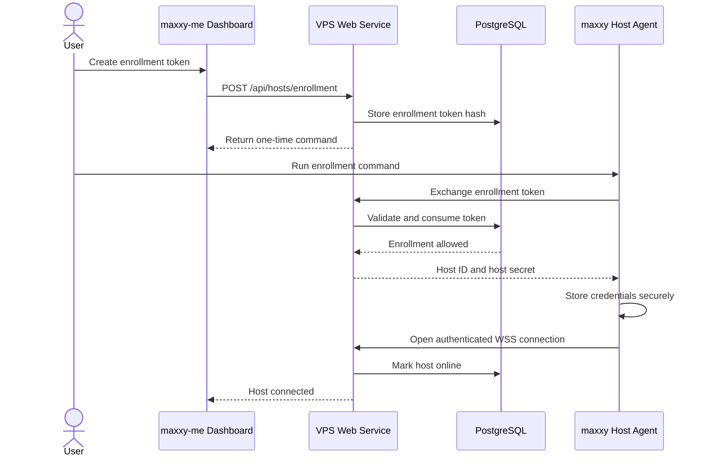

### 6.3 Host configuration

The user configures on the host:

```text
Project root
/home/user/projects

Worktree root
/home/user/.local/share/maxxy-me/worktrees

Codex accounts root
/home/user/.local/share/maxxy-me/codex-accounts

Maximum agents
4
```

The host agent must reject paths outside these roots.

---

## 7. Host Connection Flow

The host agent maintains an outbound WebSocket connection.

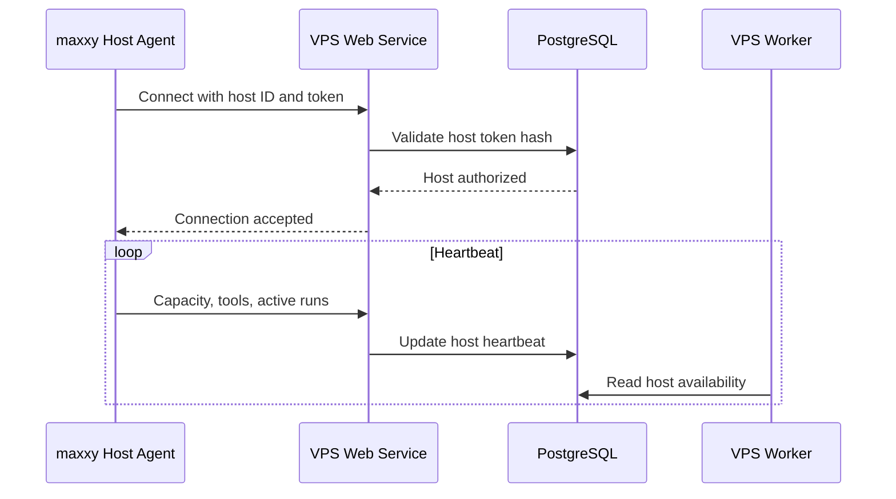

The host remains usable behind NAT because it opens the connection itself.

---

## 8. Codex Connections and Capacity Pool Flow

Codex authentication occurs on each execution host. The user may add several authorized connections, but every connection keeps a separate credential namespace, identity, status, and capacity lease.

The user opens:

```text
Hosts → <Host> → Codex connections
```

```text
Codex connections

Personal Pro       Ready       0/1 active
Secondary account  Cooldown    resets when reported
API project         Ready       1/4 active

[Add connection] [Manage capacity pool]
```

Selecting **Add connection** opens:

```text
Connection label
[ Personal Pro                         ]

Capacity source
(●) New ChatGPT account or API project
( ) Existing source on another host

Choose authentication

(●) Sign in with ChatGPT
( ) Use OpenAI API key
( ) Use enterprise access token, when supported

[✓] I am authorized to use this connection and its plan/workspace permits this automation.

[Start setup]
```

The connection label is user-defined. A masked account or workspace hint may be shown only when the official Codex client supplies it. maxxy-me never asks the user to paste a ChatGPT password, browser cookie, `auth.json`, or refresh token into the dashboard.

When the same provider identity is connected on another host, the user attaches it to the existing capacity source. The dashboard counts its provider budget once while still showing both host-local lanes. If a stable identity hint is unavailable, maxxy-me shows a duplicate-capacity warning instead of silently adding the estimates together.

### 8.1 ChatGPT connection

For a machine with a browser:

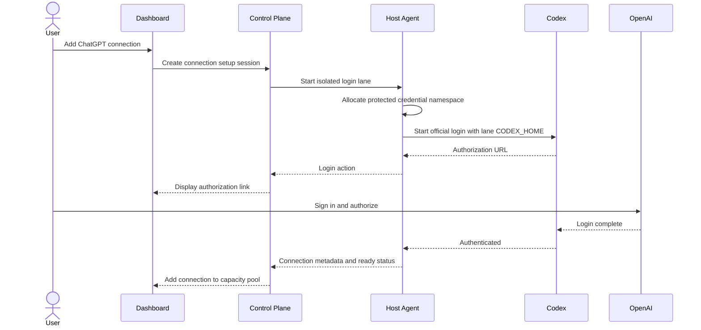

For a headless host, the same flow uses `codex login --device-auth` when supported. Each login runs with a distinct connection-specific `CODEX_HOME`; version one configures `cli_auth_credentials_store = "file"` in that lane. The cached credential file is treated like a password and remains on that host.

### 8.2 API-key connection

The API key is entered locally on the execution host using a hidden prompt or an approved OS secret store. It is not submitted through maxxy-me's browser, stored in PostgreSQL, or placed in control-plane environment files.

It must not be returned to the browser after setup.

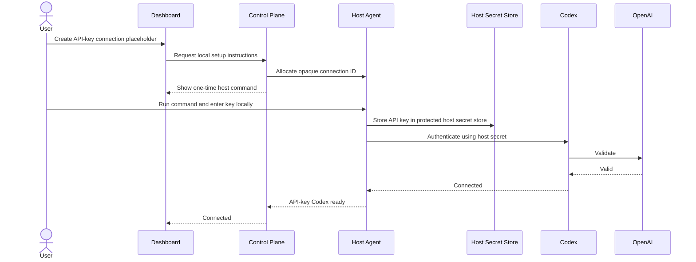

API-key tasks use standard API billing and model availability for that key. The connection may have configurable concurrency, but the host still enforces observed provider rate limits and local policy.

### 8.3 Capacity-pool configuration

After adding at least one connection, the user opens:

```text
Settings → Codex capacity pools → Default pool

Routing policy
(●) Balanced available capacity
( ) Ordered priority
( ) Manual only

Connections
[✓] Personal Pro          Priority 10   Max active 1
[✓] Secondary account    Priority 20   Max active 1
[✓] API project           Priority 30   Max active 4

Fail over before a new turn starts
[✓]

Require confirmation when billing mode changes
[✓]

[Save pool]
```

The dashboard summary shows:

- ready, limited, cooling-down, expired, and disabled connections;
- active and queued connection leases;
- supported reset times and usage observations;
- an **estimated pooled capacity** label when exact provider data is unavailable;
- which connection ran each task attempt.

The pool never rewrites provider limits into one OpenAI entitlement. It is a maxxy-me scheduling view across separate authorized boundaries.

A provider suspension or policy enforcement state disables that lane. maxxy-me does not rotate identities to retry around enforcement.

### 8.4 Remove or reauthenticate a connection

Removing a connection stops new assignment immediately. If it has an active run, the user must stop that run or wait for a safe boundary before local credentials are deleted.

Reauthentication uses the same isolated lane. It must not overwrite another connection's `CODEX_HOME`, API key, or access token.

---

## 9. GitHub Setup Flow

GitHub is used for:

- repository access;
- task branch pushes;
- pull requests;
- checks;
- reviews;
- merge status.

### 9.1 Control-plane GitHub App

The owner installs the maxxy-me GitHub App for selected repositories.

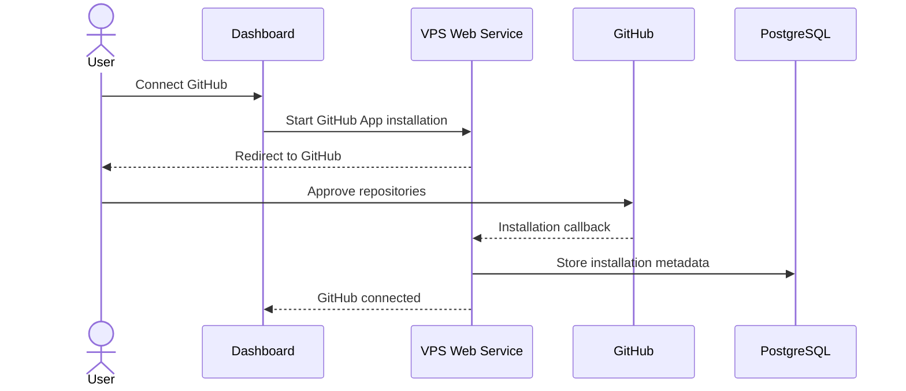

### 9.2 Host push authentication

Each execution host authenticates Git separately, usually through:

```bash
gh auth login
```

or its existing Git credential manager.

The control plane stores status and metadata, not raw push credentials.

---

## 10. Creating a Workspace

The user opens:

```text
Workspaces → New workspace
```

```text
Workspace name
[ maxxy-me                              ]

GitHub repository
[ omakidx/maxxy-me                   ▾ ]

Default execution host
[ Personal Development Computer      ▾ ]

Repository path
[ /home/user/projects/maxxy-me          ]

Base branch
[ main                                  ]

Worktree root
[ /home/user/.local/share/maxxy-me/worktrees ]

Maximum concurrent agents
[ 4                                     ]

Codex capacity pool
[ Default pool                        ▾ ]

Root agent profile
[ Root / Manager · GPT-5.6 Sol · Medium ▾ ]

Default expert model policy
[ GPT-5.5 · High                       ▾ ]

[Validate and create]
```

Validation checks:

- host online;
- host protocol compatible;
- at least one eligible Codex connection in the selected pool;
- root and default expert model/effort combinations available on at least one eligible connection;
- required default skill versions published and available;
- Git installed;
- GitHub push authentication valid;
- repository exists or can be cloned;
- base branch exists;
- project root allowed;
- worktree root writable.

---

## 11. Reusable Skills, Agent Profiles, and Model Settings

### 11.1 Create and publish a skill

The user opens:

```text
Settings → Skills → New skill
```

```text
Name
[ Figma-to-Code Expert                         ]

Slug
[ figma-to-code                                ]

Description
[ Convert approved Figma designs into production UI. ]

SKILL.md instructions
[ Edit instructions...                         ]

Optional package files
[ Add SKILL.json, references, templates, assets, scripts ]

[Save draft] [Validate] [Publish version 1]
```

Validation shows:

- required `SKILL.md` present;
- valid package paths, file count, and size;
- optional manifest structure;
- declared tool, environment, or connector dependencies;
- scripts that will remain subject to normal sandbox and approval policy;
- content hash of the version to be published.

Publishing creates an immutable version. Editing published content creates a new draft and later a new version. A skill may be reused by several agent profiles without duplicating its package.

### 11.2 Configure the root agent and experts

The user opens:

```text
Settings → Agents
```

Root example:

```text
Agent profile
[ Root / Manager                               ]

Model
[ GPT-5.6 Sol · gpt-5.6-sol                  ▾ ]

Reasoning effort
[ Medium                                     ▾ ]

Skills
[ architecture-planning@2 ] [ task-decomposition@1 ]

Can delegate child agents
[ Yes ]

[Save profile]
```

Expert example:

```text
Agent profile
[ Figma-to-Code Expert                         ]

Model
[ GPT-5.5 · gpt-5.5                          ▾ ]

Reasoning effort
[ High                                       ▾ ]

Skills
[ figma-to-code@3 ]

Sandbox
[ Workspace write                            ▾ ]

[Save profile]
```

The model list and reasoning options come from the selected host and Codex connection. If `gpt-5.5` does not report `high`, that combination cannot be saved for immediate use on that connection. The user may select another compatible connection or configure an explicit ordered fallback. The default fallback behavior is **Block and ask me**.

Settings inheritance is visible in the UI:

```text
System default
  → workspace default
    → role default
      → agent-profile override
        → task-run override
```

Before execution, maxxy-me shows the effective connection, model, reasoning effort, exact skill versions, sandbox, and approval policy. Saving a setting changes future attempts; it never silently mutates an active turn.

### 11.3 Skill and model resolution sequence

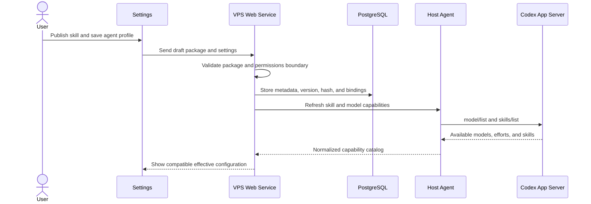

---

## 12. Opening a Workspace

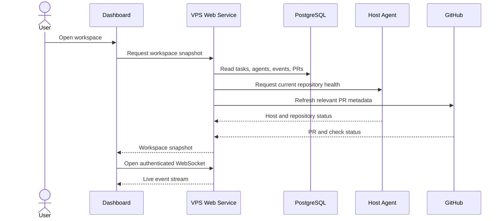

---

## 13. Creating a Task

The user selects:

```text
New task
```

```text
Goal
Add organization-based access control.

Planning mode
(●) Let the root agent create the plan
( ) Define the tasks manually

Root agent
[ Root / Manager · GPT-5.6 Sol · Medium       ▾ ]

Default host
[ Personal Development Computer      ▾ ]

Codex capacity pool
[ Workspace default                  ▾ ]

Task-level overrides
[ Use agent-profile models and skills           ]

Completion
[ Open pull requests for review         ]

[Create plan]
```

### Root planning and plan-approval flow

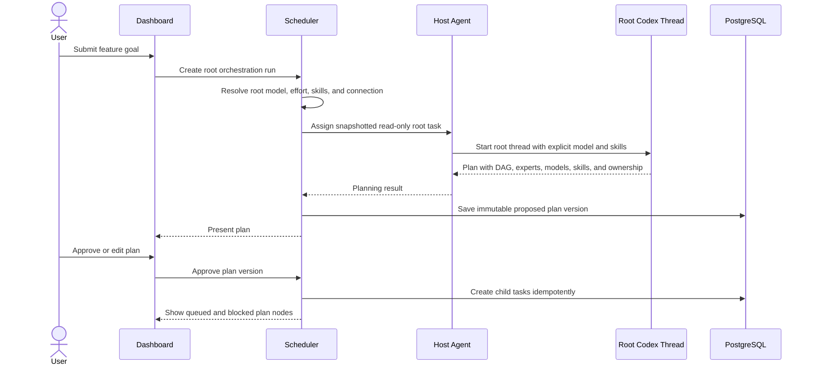

---

## 14. Running a Codex Task

This is the primary execution flow.

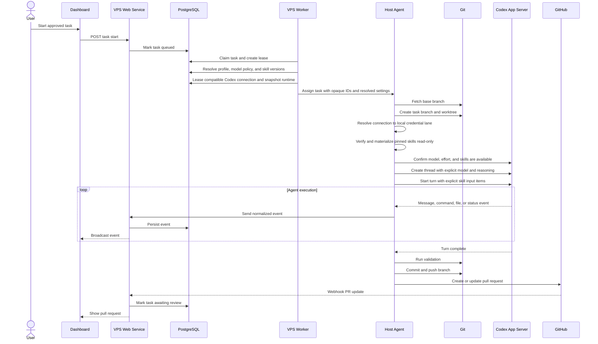

The task header displays a runtime badge such as:

```text
Figma-to-Code Expert
Model: GPT-5.5 · High
Skills: figma-to-code@3
Connection: Secondary ChatGPT lane
Attempt: 1
```

Changing the profile while this turn is active does not change the badge or runtime. The user must stop and create a new attempt or approve an explicit handoff.

---

## 15. Approval Flow

When Codex requests a sensitive action:

```text
Approval required

Agent
Backend Agent

Task
Add organization access control

Host
Personal Development Computer

Operation
bun run db:migrate

Risk
Database schema change

[Decline] [Approve once] [Approve for session]
```

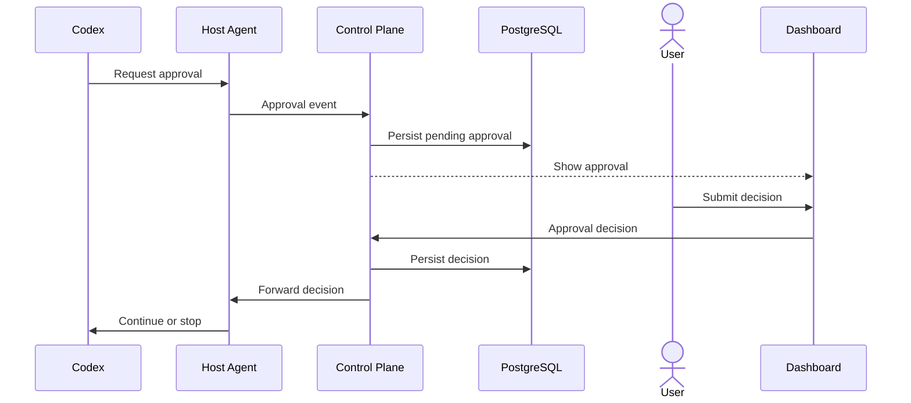

---

## 16. Parallel Agent Flow

Independent tasks may run together.

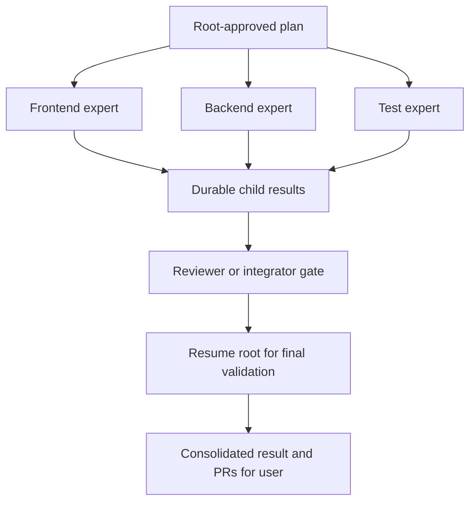

The scheduler starts tasks only when:

- dependencies are complete;
- an eligible host is online;
- host capacity is available;
- an eligible Codex connection has capacity and no active cooldown;
- both the host lease and connection lease can be acquired atomically;
- the task has an exclusive worktree;
- required ownership does not conflict.
- the selected connection supports the profile's snapshotted model and reasoning effort;
- every required skill version is available and hash-verified.

When every required child reaches its completion gate, the worker persists a result bundle and resumes the root thread. The root checks the approved goal, child summaries, changed files, commits, pull requests, validation evidence, conflicts, and risks.

If follow-up work is needed, the root proposes bounded child tasks. Material plan changes return to the user for approval. When complete, the root sends one consolidated result; it never merges.

---

## 17. Pull-Request Creation

After implementation:

1. required validation commands run;
2. Git status and diff are collected;
3. the task branch is committed;
4. the branch is pushed;
5. a draft pull request is created;
6. the task becomes `awaiting_review`;
7. GitHub checks are synchronized.

The pull request contains:

- task summary;
- agent role;
- implementation notes;
- changed files;
- validation results;
- risks;
- dependency pull requests;
- maxxy task ID;
- execution host.

Agents cannot merge.

---

## 18. Review and Request Changes

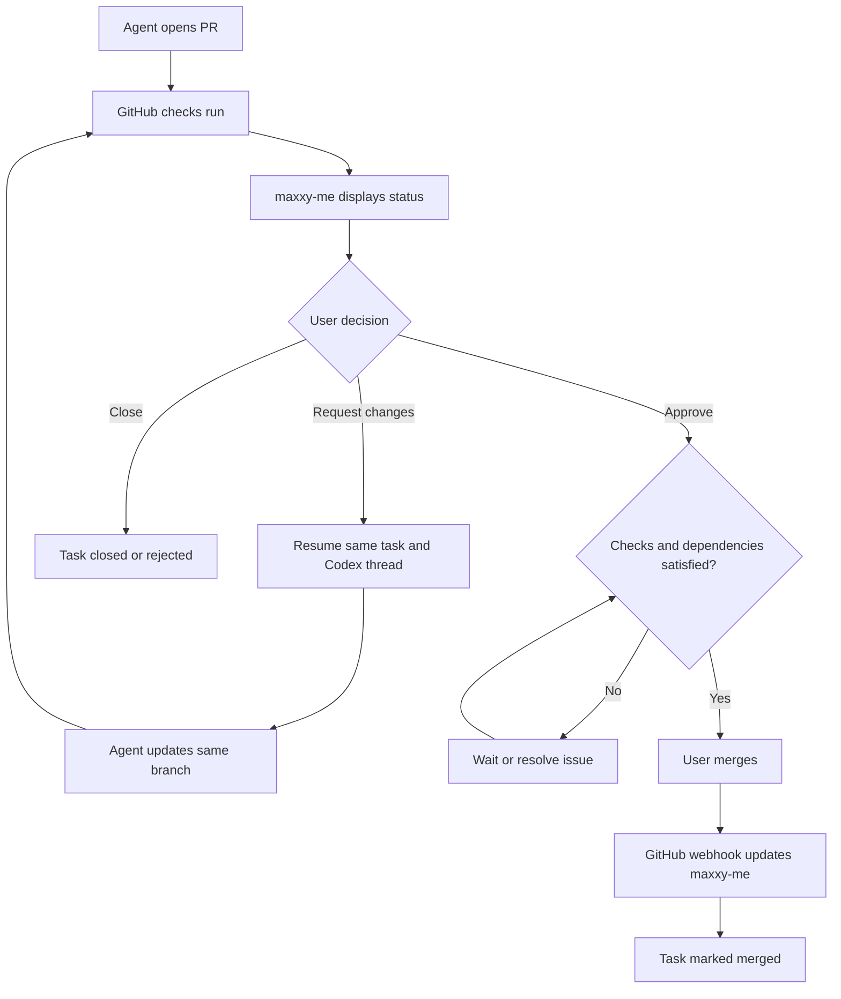

Requested changes normally continue with the same:

- task;
- branch;
- worktree;
- Codex thread;
- Codex connection;
- pull request.

If the original connection is unavailable before a new turn, the dashboard offers a controlled failover. maxxy-me creates a new task attempt and Codex thread, records the source and destination connections, and supplies an explicit handoff summary. It never presents this as migration of the original live thread.

---

## 19. Codex SDK Flow

The Codex SDK may be used internally for structured programmatic jobs.

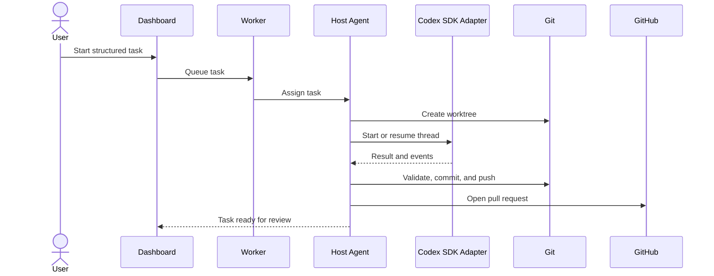

The dashboard consumes the same normalized internal events regardless of whether App Server or SDK was used.

---

## 20. Codex Web Companion Flow

Codex Web is an external companion surface, not the primary controlled runtime.

```text
Task actions
[Run through maxxy-me] [Open in Codex Web]
```

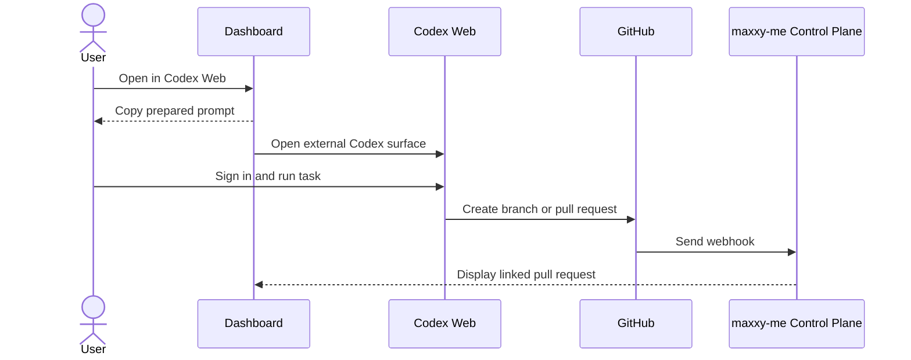

maxxy-me does not:

- scrape Codex Web;
- reuse ChatGPT browser cookies;
- claim control over unsupported cloud APIs.

---

## 21. Personal maxxy-me API Flow

Trusted scripts may create tasks through a private API.

```http
POST /api/v1/tasks
Authorization: Bearer <personal-token>
Content-Type: application/json
```

```json
{
  "workspaceId": "ws_maxxy",
  "title": "Add health-check endpoint",
  "prompt": "Implement the endpoint and tests.",
  "agentProfile": "backend",
  "hostId": "host_personal",
  "runtime": "codex_app_server",
  "openPullRequest": true
}
```

Personal API tokens are scoped and stored as secure hashes.

Merge permission is disabled by default.

---

## 22. Host Offline Flow

```text
Personal Development Computer

Status
Offline

Last heartbeat
12 minutes ago

Affected tasks
2

[Retry] [View diagnostics] [Move eligible queued tasks]
```

Behavior:

- no new task is assigned;
- queued tasks remain queued;
- active leases eventually expire;
- unpushed dirty worktrees remain on the host;
- maxxy-me does not pretend uncertain work is lost;
- reconnect triggers reconciliation.

---

## 23. VPS Service Restart and Reboot Flow

The web, worker, database, reverse proxy, host agent, or entire VPS may restart. Cloudflare continues serving the domain, but the origin is unavailable until the required services are healthy.

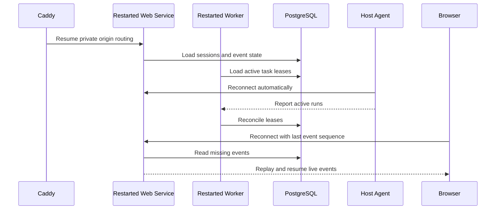

Durable state is stored in explicit PostgreSQL, repository, worktree, Caddy, and host-agent volumes or host directories—not in container writable layers. systemd and Compose restart policies restore services after a VPS reboot; the deployment health check waits for migrations and PostgreSQL before declaring the origin ready.

---

## 24. Codex Connection Limited or Authentication Expired

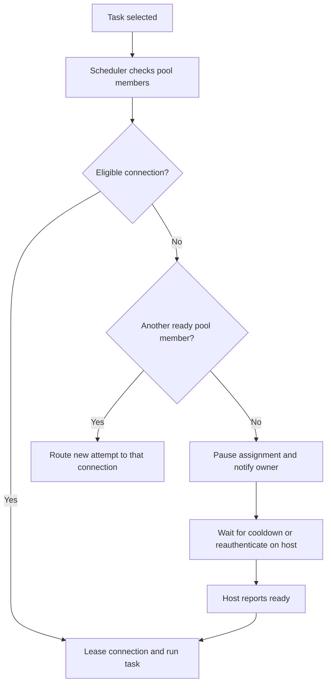

maxxy-me must not move an active turn between accounts or silently switch billing modes. When failover changes from included ChatGPT usage to API billing, the configured confirmation policy applies.

---

## 25. GitHub Authentication Failed

If code is complete but push authentication fails:

```text
Task
Completed locally

Branch
maxxy/task-42/backend

Push
Failed

Reason
GitHub authentication required on host

[Reconnect GitHub] [Retry push] [View diff]
```

The branch and worktree remain intact.

---

## 26. Merge Conflict Flow

```text
Pull Request #42

Status
Merge conflict

Options

[Ask integration agent to resolve]
[Resolve manually]
[Close task]
```

The integration agent may update the task branch but cannot merge it.

---

## 27. Workspace Dashboard

```text
┌───────────────────────────────────────────────────────────────┐
│ maxxy-me / Project       Hosts: 2 online · Pool: 3/4 ready  │
├──────────────┬──────────────────────────────┬─────────────────┤
│ Navigation   │ Agent workspace              │ Review panel    │
│              │                              │                 │
│ Overview     │ Backend Agent                │ Pull Request 42 │
│ Tasks        │ Running validation...        │ Checks: 3/4     │
│ Agents       │                              │ Files: 8        │
│ Skills       │ Model: GPT-5.5 · High        │                 │
│ Pull Requests│ Frontend Agent               │                 │
│ Hosts        │ Awaiting review              │ [Open diff]     │
│ Codex pool   │ Lane: Personal Pro           │ [Review]        │
│ Settings     │ Skills: figma-to-code@3      │                 │
├──────────────┴──────────────────────────────┴─────────────────┤
│ Activity: commands, approvals, host status, GitHub updates   │
└───────────────────────────────────────────────────────────────┘
```

Typical session:

```text
Sign in
  ↓
Open workspace
  ↓
Check host and Codex capacity-pool status
  ↓
Check root/expert models, reasoning efforts, and skill versions
  ↓
Create or approve tasks
  ↓
Monitor agents
  ↓
Respond to approvals
  ↓
Review pull requests
  ↓
Receive root-agent final synthesis
  ↓
Request changes or merge
```

---

## 28. State Models

### Host

```text
unknown
connecting
online
degraded
offline
authentication_required
revoked
```

### Codex connection

```text
not_installed
signed_out
authenticating
ready_chatgpt
ready_api_key
ready_enterprise_access_token
limited
cooldown
expired
disabled
policy_blocked
revoked
error
```

### Codex capacity lease

```text
pending
active
released
expired
cancelled
```

### Task

```text
draft
planning
awaiting_plan_approval
delegating
waiting_for_children
queued
ready
assigned
claimed
starting
running
awaiting_approval
blocked
validating
integrating
finalizing
pushing
opening_pull_request
awaiting_review
changes_requested
merged
failed
cancelled
```

### Skill

```text
draft
validating
published
disabled
archived
invalid
```

### Orchestration run

```text
planning
awaiting_plan_approval
delegating
waiting_for_children
integrating
finalizing
awaiting_user_review
completed
failed
cancelled
```

### Pull request

```text
not_created
draft
open
changes_requested
approved
checks_failed
merge_conflict
merged
closed
```

---

## 29. Screen Map

```text
/auth/sign-in
/setup
/setup/owner
/setup/github
/setup/first-host

/workspaces
/workspaces/new
/workspaces/:workspaceId
/workspaces/:workspaceId/tasks
/workspaces/:workspaceId/tasks/:taskId
/workspaces/:workspaceId/agents
/workspaces/:workspaceId/orchestration/:runId
/workspaces/:workspaceId/pull-requests
/workspaces/:workspaceId/activity

/hosts
/hosts/new
/hosts/:hostId
/hosts/:hostId/codex
/hosts/:hostId/codex/connections/new
/hosts/:hostId/codex/connections/:connectionId
/hosts/:hostId/github

/settings
/settings/security
/settings/developer
/settings/tokens
/settings/codex-pools
/settings/codex-pools/:poolId
/settings/skills
/settings/skills/new
/settings/skills/:skillId
/settings/skills/:skillId/versions/:versionId
/settings/agents
/settings/agents/:profileId
/settings/models
```

---

## 30. Version-One Product Decisions

1. Codex is the only agent provider.
2. Codex App Server is the primary interactive runtime.
3. Codex SDK is an optional internal adapter.
4. Codex authentication happens on execution hosts.
5. The owner may connect multiple authorized Codex accounts, API keys, or supported enterprise access tokens.
6. Every connection has an isolated host-local credential namespace and its own provider billing and limit boundary.
7. maxxy-me exposes a logical capacity pool and routes new task attempts across eligible members.
8. Every task attempt records the selected connection; active turns never migrate between connections.
9. Git push authentication remains on execution hosts.
10. One VPS hosts the control plane, PostgreSQL, and first execution host.
11. Cloudflare manages the domain, proxied edge, visitor TLS, DNSSEC, and origin shielding; it does not host the application or database.
12. Self-hosted PostgreSQL stores durable application state and non-secret connection metadata.
13. Container writable layers are never the durable repository or database location.
14. A native non-root host agent on the VPS executes Codex tasks; additional persistent hosts may enroll later.
15. Hosts connect outbound through authenticated WSS to the Cloudflare-proxied domain.
16. Every write task gets an isolated branch and worktree.
17. Agents create or update pull requests.
18. Agents cannot merge.
19. The owner controls every merge.
20. Important events are persisted before live broadcast.
21. Codex Web remains an external companion surface.
22. Skills are Codex-compatible packages with immutable published versions and content hashes.
23. The owner can create, validate, publish, version, reuse, disable, and archive skills in Settings.
24. Skills cannot grant credentials or permissions beyond the effective host, workspace, profile, task, and approval policies.
25. Every root and expert agent profile can select its own model and supported reasoning effort.
26. Model choices are discovered from the selected Codex connection and are never silently substituted.
27. Settings resolve from system to workspace to role to profile to task override and are snapshotted per attempt.
28. The root agent creates a versioned plan, the user approves it, and the scheduler runs independent expert nodes concurrently.
29. Child agents return durable structured results; the root resumes to coordinate follow-up work, integration validation, and the final consolidated report.
30. The root, reviewer, integrator, and expert agents cannot merge.

---

## 31. End-to-End Summary

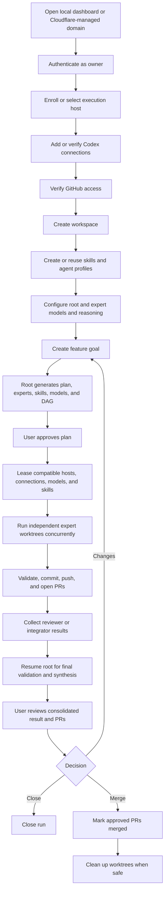

The central user experience is:

> Sign in, create reusable skills and configurable agents, let the root propose an approval-ready plan, run compatible expert agents in parallel with pinned models and skills, receive the root's validated consolidated result, and merge only the pull requests you approve.
